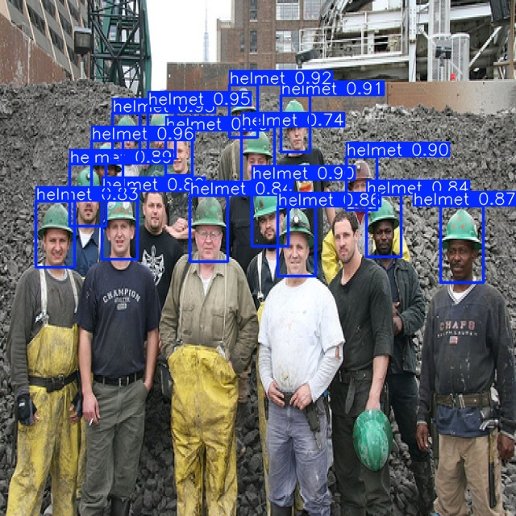
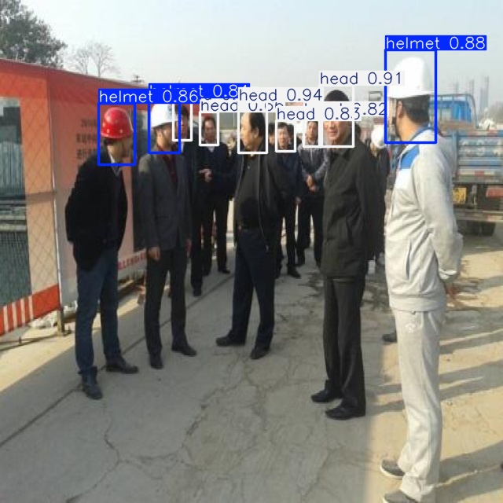
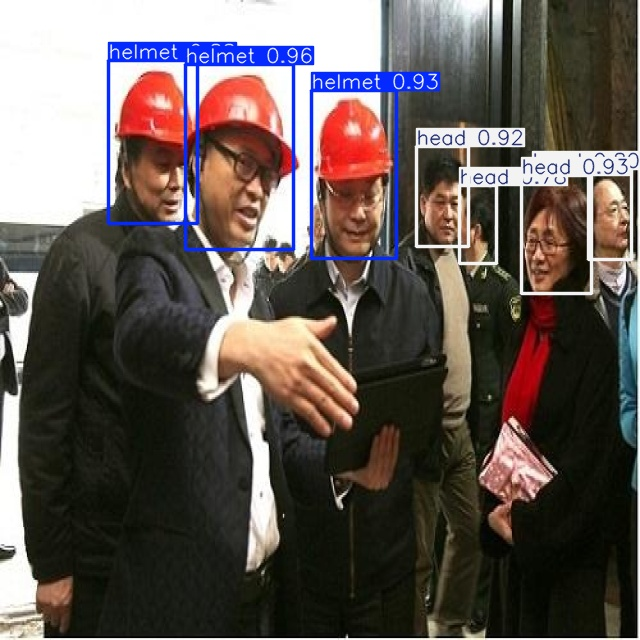

# Helmet-guard

An AI-powered safety monitoring system that detects whether construction workers are wearing proper safety equipment (helmets and vests).

## Overview

HelmetGuard uses computer vision and deep learning (YOLOv8) to identify safety violations in construction sites by detecting workers who are not wearing appropriate safety gear.

## Detection Results

### Video Detection


The demo above shows the YOLOv8 model detecting safety equipment in construction site footage

### Image Detection





These images show detection of safety equipment on static construction site photos

## Installation

```bash
# Clone this repository
git clone https://github.com/yourusername/helmet-guard.git
cd helmet-guard

# Create and activate virtual environment
python -m venv .venv
source .venv/bin/activate  # On Windows: .venv\Scripts\activate

# Install dependencies
pip install -r requirements.txt
```

## Dataset

This project uses the "Hardhat + Vests" dataset from Kaggle.

To run this project:

1. Download the dataset from [Kaggle](https://www.kaggle.com/datasets/muhammetzahitaydn/hardhat-vest-dataset-v3?resource=download)
2. Extract the contents to the `datasets/helmet_data` directory
3. Ensure the directory structure matches what's specified in `config/data.yaml`

## Usage

To train the model:

```bash
cd scripts
python train.py
```

To run detection on a video:

```bash
cd scripts
python detect_video.py
```

## Test Videos

This project uses free stock videos from [Pexels](https://www.pexels.com/) for testing and demonstration purposes.

Due to file size limitations, these videos are not included in the GitHub repository. You can:

1. Download similar construction/workplace videos from [Pexels](https://www.pexels.com/search/videos/construction%20workers/)
2. Place them in the `videos/` directory to use with the detection scripts
3. Or use your own videos showing people with/without hardhats

When using Pexels content, please respect their [license terms](https://www.pexels.com/license/).
